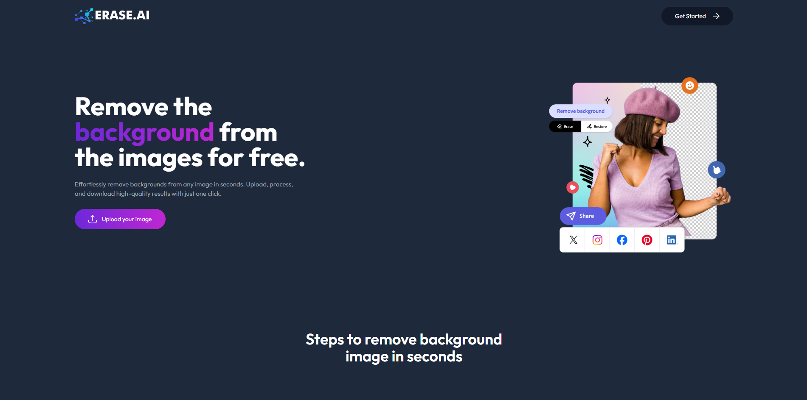
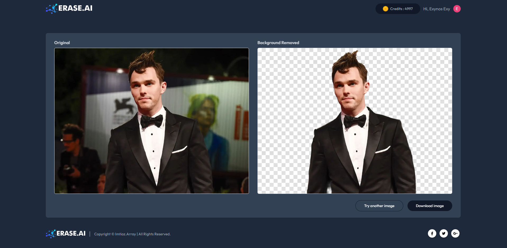
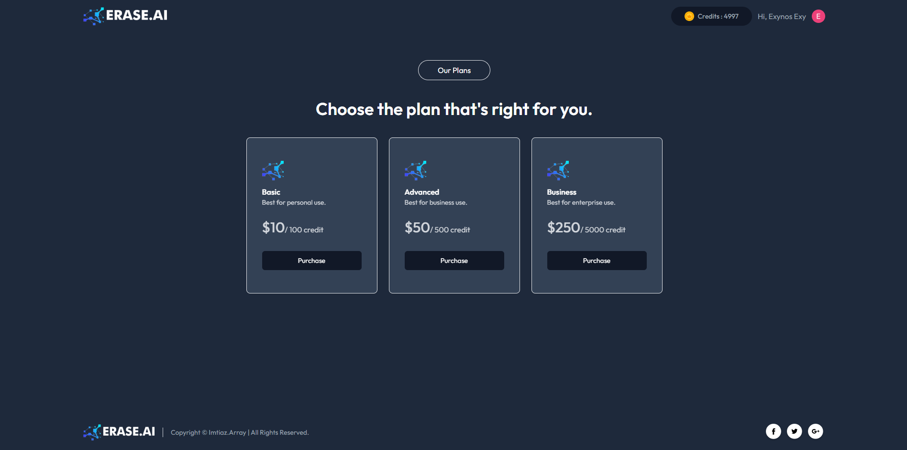
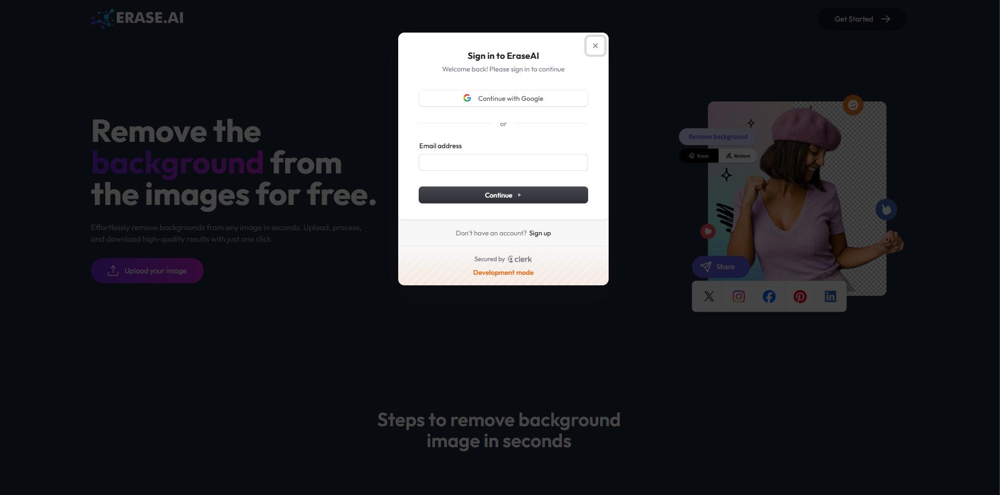

🌟 ERASE.AI Background Removal AI Application
An advanced AI-powered background removal tool built using Node.js, the MERN stack, and Tailwind CSS, leveraging the Clipdrop API from Remove.bg for seamless background removal. The application includes user authentication implemented with Clerk, a modern and secure authentication system.

🚀 Features
AI-Powered Background Removal: Quickly and accurately remove image backgrounds using the Clipdrop API.
User Authentication: Modern and secure login and access control powered by Clerk.
Responsive UI: Tailwind CSS ensures a clean and responsive design.
Full-Stack Solution: Built with the MERN stack (MongoDB, Express.js, React, Node.js).

🔧 Technologies Used
Frontend: React, Tailwind CSS
Backend: Node.js, Express.js
Database: MongoDB
API: Clipdrop API
Authentication: Clerk

🖼️ How It Works

1.  Upload an Image: Users can upload an image through a simple, intuitive UI.
2.  Background Removal: The app sends the image to the Clipdrop API, processes it, and returns a background-free version.
3.  Download: Users can download the edited image instantly.

📦 Installation & Setup

1. Clone the repository:

   ```bash
   git clone https://github.com/Imtiaz4530/EraseAI
   ```

2. Install dependencies for the frontend:

   ```bash
   cd client
   npm install
   ```

3. Install dependencies for the backend:

   ```bash
   cd server
   npm install
   ```

4. Create a `.env` file in the frontend directory and add the following:

   ```
   VITE_BACKEND_URL = <Your BACKEND URI>
   VITE_CLERK_PUBLISHABLE_KEY = <Your CLERK PUBLISHABLE KEY>
   ```

5. Create a `.env` file in the backend directory and add the following:

   ```
   MONGO_DB_URI=<Your MongoDB URI>
   CLERK_WEBHOOK_SECRET=<Your Clerk Webhook Secret>
   PORT=<Your backend port>
   CLIPDROP_API=<Your Clipdrop API>
   STRIPE_SECRET_KEY=<Your stripe secret key >
   ```

6. Run both frontend and backend:
   ```bash
   npm run dev
   ```

## Screenshots

### Patient Portal






## Contributing

Contributions are welcome! Feel free to open issues or submit pull requests to improve the Erase.AI.
